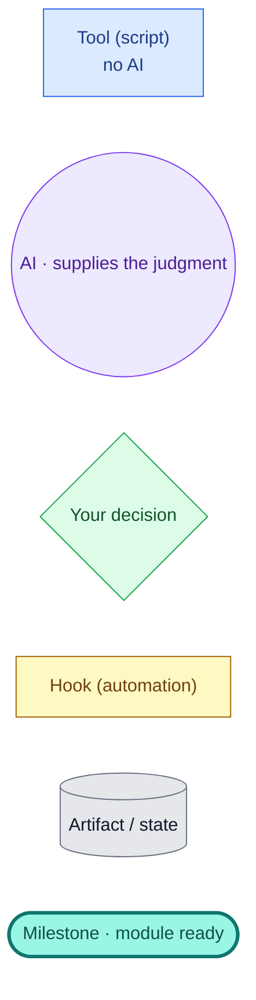
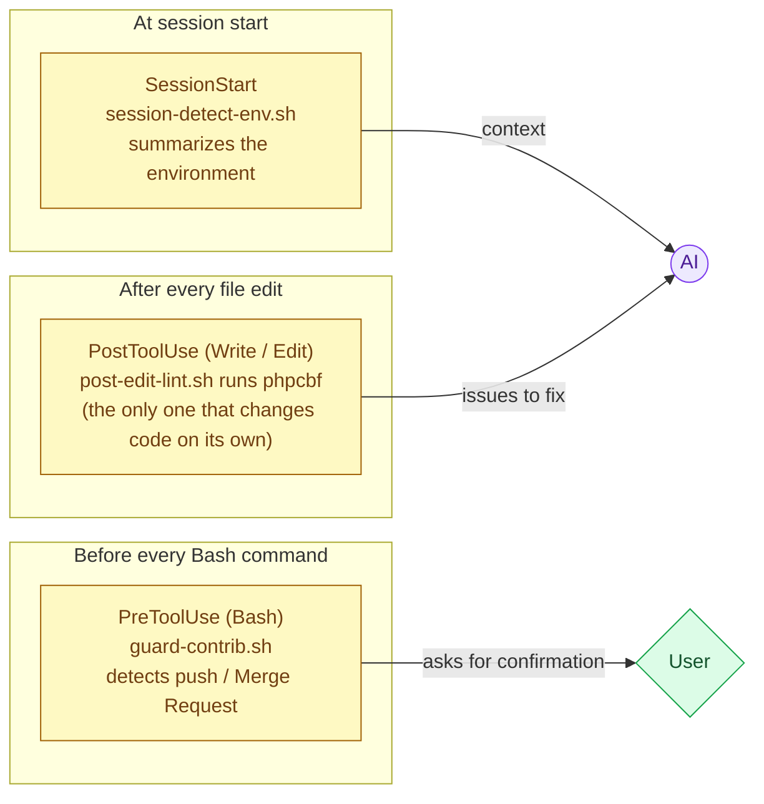

# drupilot — how it works (real flow)

A full walkthrough of a port with **drupilot**: which **tool** runs at each step and **where the AI (Claude) steps in**, all the way to the result — the **module ported to Drupal 11**.

*Read this in Spanish: [FLOW_es.md](FLOW_es.md).*

## Viewing it

This document uses **Mermaid**. To see it rendered:

- **VS Code** — install the *Markdown Preview Mermaid Support* extension and open the preview (`Ctrl+Shift+V`).
- **Browser** — paste any block into <https://mermaid.live>.
- **GitHub / GitLab** — rendered automatically when you open the `.md`.

## Legend

- 🟦 **Tool (blue):** mechanical, repeatable work, no AI.
- 🟪 **AI (purple):** reviews, decides what to apply, fixes what isn't mechanical, and chains the steps.
- 🟩 **Decision (green):** the important choices, which you approve (in autonomous mode they resolve with safe defaults).
- 🟨 **Hook (yellow):** an automation that fires on its own, without the AI asking.
- ⬜ **Artifact (gray):** files and state produced along the way.
- ◆ **Milestone (teal):** the module is ready — ported (Phase 1) or modernized (Phase 2).

---

## 1) Full flow

The AI acts as the **coordinator**: it gates each stage with `preflight`, runs the tools, interprets their output, and decides the next step. The two porting phases are shown as blocks.

```mermaid
flowchart TD
    %% --- nodes and blocks ---
    IN(["User request:<br/>'port this module to Drupal 11'"]):::human

    subgraph ROUTER["/drupilot · router"]
      RI(("The AI interprets the request,<br/>picks the mode (guided or autonomous)<br/>and proposes the next step")):::ai
    end

    subgraph DOCTOR["doctor · optional"]
      DOC["preflight.sh<br/>checks requirements"]:::script
    end

    subgraph SETUP["setup · prepare the environment"]
      SU["ddev-up.sh · ddev-add-ons.sh<br/>Composer toolchain<br/>rector.php · phpstan.neon · phpcs.xml"]:::script
    end

    subgraph ASSESS["assess · evaluation (does not modify code)"]
      AS1["Static analysis:<br/>run-rector --dry-run · run-phpstan<br/>run-phpcs · deps-status"]:::script
      AS2(("The AI classifies the work<br/>(automatic vs. manual) and issues<br/>the S/M/L/XL verdict → viability-report.md")):::ai
      AS1 --> AS2
    end

    GATE1{"Continue with<br/>the port?"}:::human

    subgraph F1["PHASE 1 · Minimal port — make the module run on Drupal 11 (may keep Drupal 10)"]
      PORT(("The AI orchestrates Rector's 3 passes<br/>(official → digests → ad-hoc),<br/>the manual changes and validation<br/>— see diagram 2")):::ai
      ART1[("Artifacts:<br/>MODULE-port-to-drupal-11.patch<br/>port-report.md")]:::result
      TST1["Tests in DDEV · run-phpunit<br/>Unit · Kernel · Functional · JS (Selenium)"]:::script
      TST2(("The AI adapts the form of the tests;<br/>on a behavioral failure it<br/>fixes the code, never the test")):::ai
      DONE1(["Module ported to Drupal 11<br/>compatible · behavior preserved · tests green"]):::milestone
      PORT --> ART1 --> TST1 --> TST2 --> DONE1
    end

    GATE2{"What next?"}:::human

    subgraph F2["PHASE 2 · Modernization — optional · Drupal 11 only"]
      RF(("The AI rewrites to the «Drupal 11 way»:<br/>attributes · dependency injection<br/>strict types · no deprecations")):::ai
      RFV["Validation at PHPStan level 5-6<br/>with tests green"]:::script
      DONE2(["Module modernized — Drupal 11 only<br/>core_version_requirement ^11 · new major version"]):::milestone
      RF --> RFV --> DONE2
    end

    subgraph CT["Contribution — optional · never in autonomous mode"]
      CC{"The user confirms<br/>each push / Merge Request"}:::human
      CP["issue-fork · open-mr<br/>make-patch (verified)"]:::script
      CC --> CP
    end

    %% --- links ---
    IN --> ROUTER
    ROUTER --> DOCTOR
    DOCTOR --> SETUP
    SETUP --> ASSESS
    ASSESS --> GATE1
    GATE1 -->|continue| PORT
    DONE1 --> GATE2
    GATE2 -->|"modernize (Phase 2)"| RF
    GATE2 -->|contribute| CC

    style F1 fill:#f0f9ff,stroke:#38bdf8,stroke-width:1px
    style F2 fill:#faf5ff,stroke:#c084fc,stroke-width:1px

    classDef script fill:#dbeafe,stroke:#2563eb,color:#1e3a8a;
    classDef ai fill:#ede9fe,stroke:#7c3aed,color:#4c1d95;
    classDef human fill:#dcfce7,stroke:#16a34a,color:#14532d;
    classDef hook fill:#fef9c3,stroke:#a16207,color:#713f12;
    classDef result fill:#e5e7eb,stroke:#6b7280,color:#111827;
    classDef milestone fill:#99f6e4,stroke:#0f766e,stroke-width:3px,color:#134e4a;
```

> **preflight** (tool) validates each stage's requirements before acting: if a hard requirement is missing, the stage stops with no side effects.
>
> If Phase 2 is skipped, the final result is the **ported module** (the Phase 1 milestone). Phase 2 and contribution are always optional.
>
> **"Orchestrates Rector's 3 passes"** does not mean the AI rewrites the code in every pass: passes 1 (official) and 2 (digests) are run by the deterministic `run-rector` script — the AI reviews the dry-run and decides what to apply. Only pass 3 (ad-hoc rules / manual fixes) is the AI's own work. See diagram 2.
>
> **Drupal version target, per phase:** Phase 1 can keep `^10 || ^11` (compatible with Drupal 10 and 11) or go `^11`-only — it is your choice (the "target version" decision). Drupal 10 support kept this way is *declared but not verified* (the tests run on Drupal 11). Phase 2 is **Drupal 11 only**: the modern rewrite assumes a backwards-incompatible change, so it moves to `^11` and a new major version.

---

## 2) Phase 1 in detail — how tools and the AI alternate

Here is the key pattern: the AI steps in **before** each tool (decide whether to run it) and **after** it (interpret the result and fix what's left).

```mermaid
flowchart TD
    %% --- nodes ---
    START(["Phase 1 start · /drupilot-port"]):::result
    CS["core-strategy.sh --json<br/>recommends the target Drupal version"]:::script
    CT{"Decision: target version<br/>keep Drupal 10 and 11 · or 11 only"}:::human
    R1D["Pass 1 · run-rector --dry-run<br/>official Rector (palantirnet)"]:::script
    R1AI(("The AI reviews the proposed changes")):::ai
    R1A["run-rector --apply<br/>applies the changes to the code"]:::script
    R2D["Pass 2 · run-rector --digests --dry-run<br/>AI-generated rules (Dries Buytaert)<br/>pinned by SHA"]:::script
    R2AI(("The AI reviews rule by rule and flags<br/>those that would raise the minimum Drupal version")):::ai
    R2T{"Decision:<br/>which rules to apply?"}:::human
    R2A["run-rector --digests --apply<br/>only the accepted subset"]:::script
    R3(("Pass 3 · the AI generates a custom rule<br/>or manually fixes what Rector doesn't cover")):::ai
    MAN(("The AI applies the manual changes<br/>Rector cannot make:<br/>core_version_requirement · require.php<br/>Twig 3 · CKEditor 5 · jQuery UI")):::ai

    subgraph VL["Validation loop · the AI iterates until clean"]
      VS["run-phpcs --fix (phpcbf fixes · phpcs reports)<br/>run-phpstan (deprecations)"]:::script
      VAI(("The AI reviews what's left<br/>and applies the minimal fix")):::ai
      VS --> VAI
      VAI -->|"issues remain"| VS
    end

    MP["make-patch --local<br/>generates the .patch"]:::script
    PR["port-report.sh<br/>generates the report"]:::script
    OUT(["Phase 1 result:<br/>module compatible with Drupal 11<br/>+ .patch + report (validated by the tests)"]):::milestone

    %% --- links ---
    START --> CS
    CS --> CT
    CT --> R1D
    R1D --> R1AI
    R1AI --> R1A
    R1A --> R2D
    R2D --> R2AI
    R2AI --> R2T
    R2T --> R2A
    R2A --> R3
    R3 --> MAN
    MAN --> VS
    VAI -->|"clean"| MP
    MP --> PR
    PR --> OUT

    classDef script fill:#dbeafe,stroke:#2563eb,color:#1e3a8a;
    classDef ai fill:#ede9fe,stroke:#7c3aed,color:#4c1d95;
    classDef human fill:#dcfce7,stroke:#16a34a,color:#14532d;
    classDef result fill:#e5e7eb,stroke:#6b7280,color:#111827;
    classDef milestone fill:#99f6e4,stroke:#0f766e,stroke-width:3px,color:#134e4a;
```

> The tools don't call each other: the AI orchestrates them, interprets their output and decides the next step. That's why it steps in between them.

---

## 3) Hooks — always-on automations

Hooks are automations that Claude Code itself fires on an event; neither the AI nor the user invokes them. Each one hands its result to a recipient, and only one changes code on its own.

---

## In short

Tools make the mechanical changes (Rector, phpcbf) and measure the result (phpcs, PHPStan, PHPUnit). The AI supplies the judgment: it reviews, decides what to apply, fixes what isn't mechanical and keeps the tests green, leaving the important decisions to you. The only element that acts on its own is the `post-edit-lint` hook, which runs `phpcbf` after each edit.
