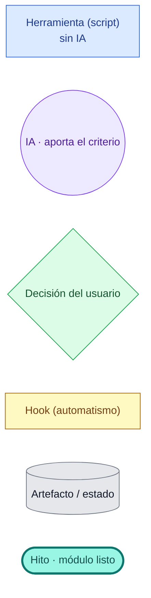
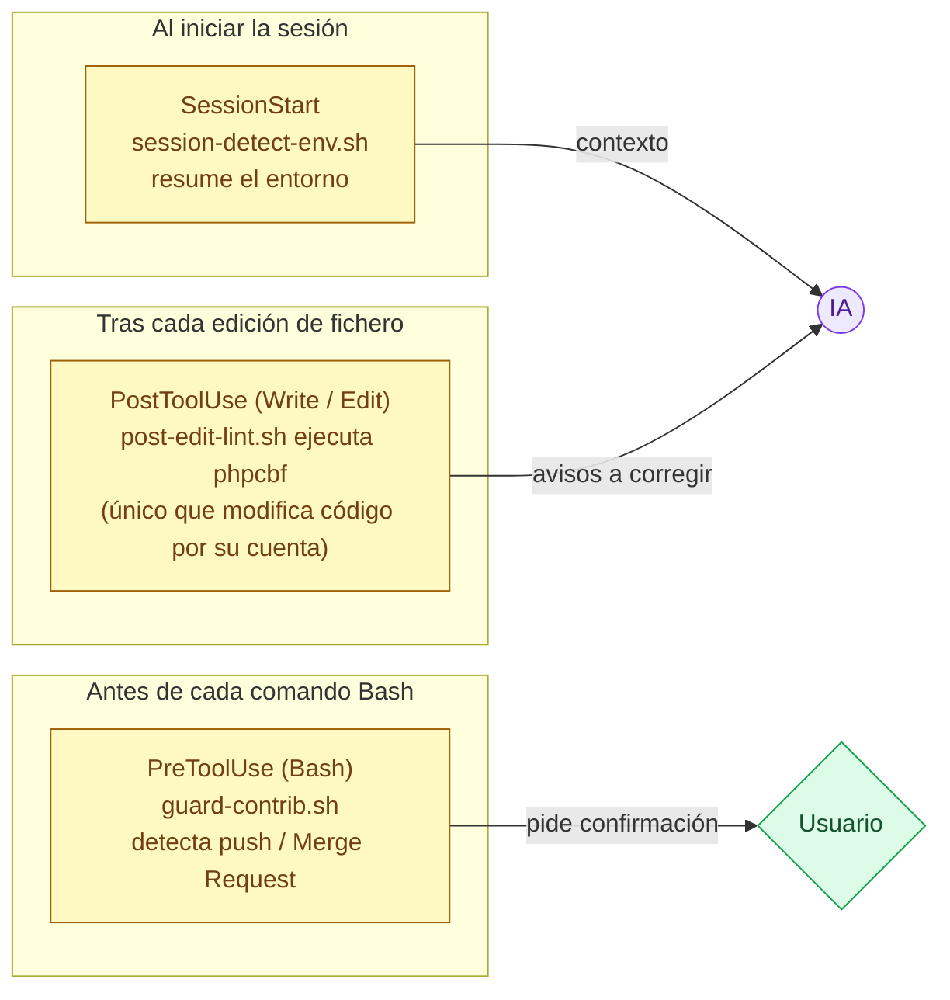

# drupilot — cómo funciona (flujo real)

Recorrido completo de una portabilidad con **drupilot**: qué **herramienta** actúa en cada paso y **dónde interviene la IA** (Claude) hasta llegar al resultado, el **módulo portado a Drupal 11**.

*Léelo en inglés: [FLOW.md](FLOW.md).*

## Cómo verlo

Este documento usa **Mermaid**. Para verlo renderizado:

- **VS Code** — instala la extensión *Markdown Preview Mermaid Support* y abre la vista previa (`Ctrl+Shift+V`).
- **Navegador** — pega cualquier bloque en <https://mermaid.live>.
- **GitHub / GitLab** — lo renderizan automáticamente al abrir el `.md`.

## Leyenda

- 🟦 **Herramienta (azul):** trabajo mecánico y repetible, sin IA.
- 🟪 **IA (morado):** revisa, decide qué aplicar, corrige lo que no es mecánico y encadena los pasos.
- 🟩 **Decisión (verde):** las elecciones importantes, que apruebas tú (en modo autónomo se resuelven con valores por defecto seguros).
- 🟨 **Hook (amarillo):** automatismo que se dispara solo, sin que la IA lo pida.
- ⬜ **Artefacto (gris):** ficheros y estado que se generan por el camino.
- ◆ **Hito (verde azulado):** el módulo queda listo — portado (Fase 1) o modernizado (Fase 2).

---

## 1) Flujo completo

La IA actúa como **coordinadora**: valida los requisitos de cada etapa con `preflight`, ejecuta las herramientas, interpreta su salida y decide el siguiente paso. Las dos fases de la portabilidad están marcadas como bloques.

```mermaid
flowchart TD
    %% --- nodos y bloques ---
    IN(["Petición del usuario:<br/>«porta este módulo a Drupal 11»"]):::human

    subgraph ROUTER["/drupilot · router"]
      RI(("La IA interpreta la petición,<br/>elige el modo (guiado o autónomo)<br/>y propone el siguiente paso")):::ai
    end

    subgraph DOCTOR["doctor · opcional"]
      DOC["preflight.sh<br/>verifica los requisitos"]:::script
    end

    subgraph SETUP["setup · preparar el entorno"]
      SU["ddev-up.sh · ddev-add-ons.sh<br/>toolchain de Composer<br/>rector.php · phpstan.neon · phpcs.xml"]:::script
    end

    subgraph ASSESS["assess · evaluación (no modifica el código)"]
      AS1["Análisis estático:<br/>run-rector --dry-run · run-phpstan<br/>run-phpcs · deps-status"]:::script
      AS2(("La IA clasifica el trabajo<br/>(automático frente a manual) y emite<br/>el veredicto S/M/L/XL → viability-report.md")):::ai
      AS1 --> AS2
    end

    GATE1{"¿Continuar con<br/>la portabilidad?"}:::human

    subgraph F1["FASE 1 · Portabilidad mínima — que el módulo funcione en Drupal 11 (puede mantener Drupal 10)"]
      PORT(("La IA conduce las 3 pasadas de Rector<br/>(oficial → digests → ad-hoc),<br/>los cambios manuales y la validación<br/>— detalle en el diagrama 2")):::ai
      ART1[("Artefactos:<br/>MODULE-port-to-drupal-11.patch<br/>port-report.md")]:::result
      TST1["Tests en DDEV · run-phpunit<br/>Unit · Kernel · Functional · JS (Selenium)"]:::script
      TST2(("La IA adapta la forma de los tests;<br/>ante un fallo de comportamiento<br/>corrige el código, nunca el test")):::ai
      DONE1(["Módulo portado a Drupal 11<br/>compatible · comportamiento preservado · tests en verde"]):::milestone
      PORT --> ART1 --> TST1 --> TST2 --> DONE1
    end

    GATE2{"¿Qué sigue?"}:::human

    subgraph F2["FASE 2 · Modernización — opcional · solo Drupal 11"]
      RF(("La IA reescribe al «estilo Drupal 11»:<br/>atributos · inyección de dependencias<br/>tipado estricto · sin deprecaciones")):::ai
      RFV["Validación a PHPStan nivel 5-6<br/>con los tests en verde"]:::script
      DONE2(["Módulo modernizado — solo Drupal 11<br/>core_version_requirement ^11 · nueva versión major"]):::milestone
      RF --> RFV --> DONE2
    end

    subgraph CT["Contribución — opcional · nunca en modo autónomo"]
      CC{"El usuario confirma<br/>cada push / Merge Request"}:::human
      CP["issue-fork · open-mr<br/>make-patch (verificado)"]:::script
      CC --> CP
    end

    %% --- enlaces ---
    IN --> ROUTER
    ROUTER --> DOCTOR
    DOCTOR --> SETUP
    SETUP --> ASSESS
    ASSESS --> GATE1
    GATE1 -->|continuar| PORT
    DONE1 --> GATE2
    GATE2 -->|"modernizar (Fase 2)"| RF
    GATE2 -->|contribuir| CC

    style F1 fill:#f0f9ff,stroke:#38bdf8,stroke-width:1px
    style F2 fill:#faf5ff,stroke:#c084fc,stroke-width:1px

    classDef script fill:#dbeafe,stroke:#2563eb,color:#1e3a8a;
    classDef ai fill:#ede9fe,stroke:#7c3aed,color:#4c1d95;
    classDef human fill:#dcfce7,stroke:#16a34a,color:#14532d;
    classDef hook fill:#fef9c3,stroke:#a16207,color:#713f12;
    classDef result fill:#e5e7eb,stroke:#6b7280,color:#111827;
    classDef milestone fill:#99f6e4,stroke:#0f766e,stroke-width:3px,color:#134e4a;
```

> **preflight** (herramienta) valida los requisitos de cada etapa antes de actuar: si falta uno imprescindible, la etapa se detiene sin dejar efectos secundarios.
>
> Si no se hace la Fase 2, el resultado final es el **módulo portado** (hito de la Fase 1). La Fase 2 y la contribución son siempre opcionales.
>
> **«La IA conduce las 3 pasadas de Rector»** no significa que la IA reescriba el código en todas las pasadas: las pasadas 1 (oficial) y 2 (digests) las ejecuta el script determinista `run-rector` — la IA revisa el dry-run y decide qué aplicar. Solo la pasada 3 (reglas ad-hoc / arreglos manuales) es trabajo propio de la IA. Ver el diagrama 2.
>
> **Versión de Drupal objetivo, según la fase:** la Fase 1 puede mantener `^10 || ^11` (compatible con Drupal 10 y 11) o ir a solo `^11` — lo decides tú (la decisión «versión objetivo»). El soporte de Drupal 10 mantenido así queda *declarado pero no verificado* (los tests corren en Drupal 11). La Fase 2 es **solo Drupal 11**: la reescritura moderna asume una ruptura de compatibilidad, así que pasa a `^11` y a una nueva versión major.

---

## 2) Fase 1 en detalle — cómo se alternan las herramientas y la IA

Aquí se ve el patrón clave: la IA interviene **antes** de cada herramienta (decidir si la ejecuta) y **después** (interpretar el resultado y corregir lo que queda).

```mermaid
flowchart TD
    %% --- nodos ---
    START(["Inicio de la Fase 1 · /drupilot-port"]):::result
    CS["core-strategy.sh --json<br/>recomienda la versión de Drupal objetivo"]:::script
    CT{"Decisión: versión objetivo<br/>mantener Drupal 10 y 11 · o solo 11"}:::human
    R1D["Pasada 1 · run-rector --dry-run<br/>Rector oficial (palantirnet)"]:::script
    R1AI(("La IA revisa los cambios propuestos")):::ai
    R1A["run-rector --apply<br/>aplica los cambios al código"]:::script
    R2D["Pasada 2 · run-rector --digests --dry-run<br/>reglas generadas por IA (Dries Buytaert)<br/>fijadas por SHA"]:::script
    R2AI(("La IA revisa regla por regla y marca<br/>las que elevarían la versión mínima de Drupal")):::ai
    R2T{"Decisión:<br/>¿qué reglas aplicar?"}:::human
    R2A["run-rector --digests --apply<br/>solo el subconjunto aceptado"]:::script
    R3(("Pasada 3 · la IA genera una regla a medida<br/>o corrige manualmente lo que Rector no cubre")):::ai
    MAN(("La IA aplica los cambios manuales<br/>que Rector no puede hacer:<br/>core_version_requirement · require.php<br/>Twig 3 · CKEditor 5 · jQuery UI")):::ai

    subgraph VL["Bucle de validación · la IA itera hasta dejarlo limpio"]
      VS["run-phpcs --fix (phpcbf corrige · phpcs informa)<br/>run-phpstan (deprecaciones)"]:::script
      VAI(("La IA revisa lo que queda<br/>y aplica la corrección mínima")):::ai
      VS --> VAI
      VAI -->|"quedan avisos"| VS
    end

    MP["make-patch --local<br/>genera el .patch"]:::script
    PR["port-report.sh<br/>genera el informe"]:::script
    OUT(["Resultado de la Fase 1:<br/>módulo compatible con Drupal 11<br/>+ .patch + informe (lo validan los tests)"]):::milestone

    %% --- enlaces ---
    START --> CS
    CS --> CT
    CT --> R1D
    R1D --> R1AI
    R1AI --> R1A
    R1A --> R2D
    R2D --> R2AI
    R2AI --> R2T
    R2T --> R2A
    R2A --> R3
    R3 --> MAN
    MAN --> VS
    VAI -->|"sin avisos"| MP
    MP --> PR
    PR --> OUT

    classDef script fill:#dbeafe,stroke:#2563eb,color:#1e3a8a;
    classDef ai fill:#ede9fe,stroke:#7c3aed,color:#4c1d95;
    classDef human fill:#dcfce7,stroke:#16a34a,color:#14532d;
    classDef result fill:#e5e7eb,stroke:#6b7280,color:#111827;
    classDef milestone fill:#99f6e4,stroke:#0f766e,stroke-width:3px,color:#134e4a;
```

> Las herramientas no se llaman entre sí: es la IA quien las ordena, interpreta su salida y decide el siguiente paso. Por eso interviene entre una y otra.

---

## 3) Hooks — automatismos siempre activos

Los hooks son automatismos que dispara el propio Claude Code ante un evento; ni la IA ni el usuario los invocan. Cada uno entrega su resultado a un destinatario, y solo uno modifica código por su cuenta.

---

## En resumen

Las herramientas realizan los cambios mecánicos (Rector, phpcbf) y miden el resultado (phpcs, PHPStan, PHPUnit). La IA aporta el criterio: revisa, decide qué aplicar, corrige lo que no es mecánico y mantiene los tests en verde, dejando en tus manos las decisiones importantes. El único elemento que actúa por su cuenta es el hook `post-edit-lint`, que ejecuta `phpcbf` tras cada edición.
