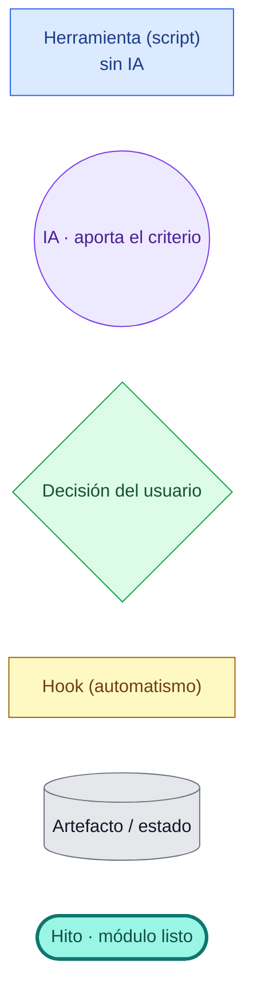
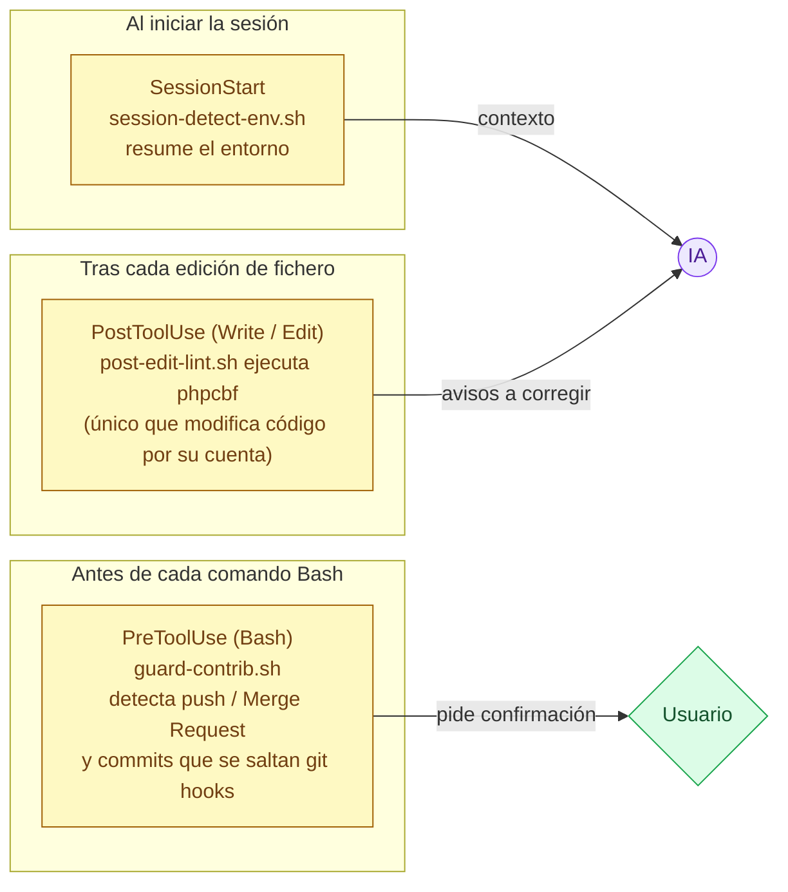
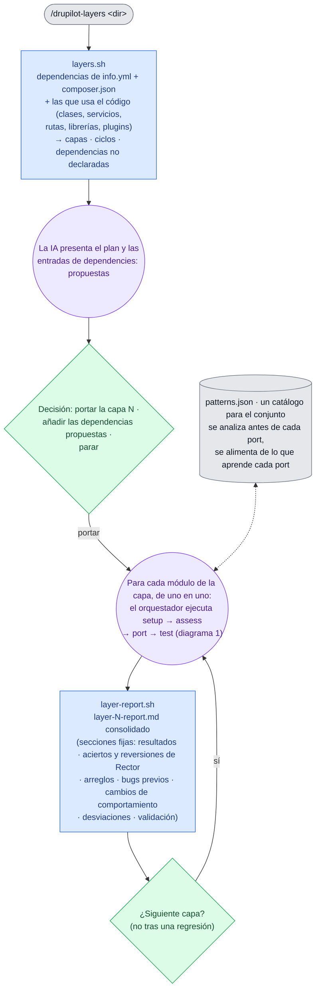
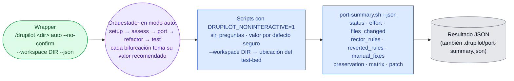

# drupilot — cómo funciona (flujo real)

Recorrido completo de una portabilidad con **drupilot**: qué **herramienta** actúa en cada paso y **dónde interviene la IA** (Claude) hasta llegar al resultado, el **módulo portado a Drupal 11**.

*Léelo en inglés: [FLOW.md](FLOW.md).*

## Cómo verlo

Este documento usa **Mermaid**. Para verlo renderizado:

- **VS Code** — instala la extensión *Markdown Preview Mermaid Support* y abre la vista previa (`Ctrl+Shift+V`).
- **Navegador** — pega cualquier bloque en <https://mermaid.live>.
- **GitHub / GitLab** — lo renderizan automáticamente al abrir el `.md`.

## Leyenda

```mermaid
flowchart LR
  L1["Herramienta (script)<br/>sin IA"]:::script
  L2(("IA · aporta el criterio")):::ai
  L3{"Decisión del usuario"}:::human
  L4["Hook (automatismo)"]:::hook
  L5[("Artefacto / estado")]:::result
  L6(["Hito · módulo listo"]):::milestone

  classDef script fill:#dbeafe,stroke:#2563eb,color:#1e3a8a;
  classDef ai fill:#ede9fe,stroke:#7c3aed,color:#4c1d95;
  classDef human fill:#dcfce7,stroke:#16a34a,color:#14532d;
  classDef hook fill:#fef9c3,stroke:#a16207,color:#713f12;
  classDef result fill:#e5e7eb,stroke:#6b7280,color:#111827;
  classDef milestone fill:#99f6e4,stroke:#0f766e,stroke-width:3px,color:#134e4a;
```

- 🟦 **Herramienta (azul):** trabajo mecánico y repetible, sin IA.
- 🟪 **IA (morado):** revisa, decide qué aplicar, corrige lo que no es mecánico y encadena los pasos.
- 🟩 **Decisión (verde):** las elecciones importantes, que apruebas tú (en modo autónomo se resuelven con valores por defecto seguros).
- 🟨 **Hook (amarillo):** automatismo que se dispara solo, sin que la IA lo pida.
- ⬜ **Artefacto (gris):** ficheros y estado que se generan por el camino.
- ◆ **Hito (verde azulado):** el módulo queda listo — portado (Fase 1) o modernizado (Fase 2).

---

## 1) Flujo completo

La IA actúa como **coordinadora**: valida los requisitos de cada etapa con `preflight`, ejecuta las herramientas, interpreta su salida y decide el siguiente paso. Las dos fases de la portabilidad están marcadas como bloques.

```mermaid
flowchart TD
    %% --- nodos y bloques ---
    IN(["Petición del usuario:<br/>«porta este módulo a Drupal 11»"]):::human

    subgraph ROUTER["/drupilot · router"]
      RI(("La IA interpreta la petición,<br/>elige el modo (guiado o autónomo)<br/>y propone el siguiente paso")):::ai
    end

    subgraph DOCTOR["doctor · opcional"]
      DOC["preflight.sh<br/>verifica los requisitos<br/>+ comprobaciones de salud (--extended):<br/>configs · toolchain frente a known-good<br/>disco · restos en el origen"]:::script
    end

    subgraph SETUP["setup · preparar el entorno"]
      SU["ddev-up.sh · place-subject.sh · ddev-add-ons.sh<br/>install-toolchain.sh (known-good, prueba de humo)<br/>render-templates.sh: rector.php · phpstan.neon · phpcs.xml"]:::script
    end

    subgraph ASSESS["assess · evaluación (no modifica el código)"]
      AS1["Análisis estático:<br/>run-rector --dry-run · run-phpstan<br/>run-phpcs · deps-status<br/>lint-extension-metadata (higiene previa)"]:::script
      AS2(("La IA clasifica el trabajo<br/>(automático frente a manual) y emite<br/>el veredicto S/M/L/XL → viability-report.md<br/>(la higiene se informa, fuera del veredicto)")):::ai
      AS1 --> AS2
    end

    GATE1{"¿Continuar con<br/>la portabilidad?"}:::human

    subgraph F1["FASE 1 · Portabilidad mínima — que el módulo funcione en Drupal 11 (puede mantener Drupal 10)"]
      PAT["patterns.sh scan<br/>los fallos que ya sufrieron<br/>los ports anteriores del proyecto"]:::script
      PORT(("La IA conduce las 3 pasadas de Rector<br/>(oficial → digests → ad-hoc),<br/>los cambios manuales y la validación<br/>— detalle en el diagrama 2")):::ai
      ART1[("Artefactos:<br/>MODULE-port-to-drupal-11.patch<br/>port-report.md<br/>patterns.json (lo aprendido)")]:::result
      TST1["Tests en DDEV · run-phpunit<br/>Unit · Kernel · Functional · JS (Selenium)"]:::script
      TST2(("La IA adapta la forma de los tests;<br/>ante un fallo de comportamiento<br/>corrige el código, nunca el test")):::ai
      DONE1(["Módulo portado a Drupal 11<br/>compatible · comportamiento preservado · tests en verde"]):::milestone
      PAT --> PORT --> ART1 --> TST1 --> TST2 --> DONE1
    end

    GATE2{"¿Qué sigue?"}:::human

    subgraph F2["FASE 2 · Modernización — opcional · solo Drupal 11"]
      RFA["convert-attributes.sh<br/>anotaciones de plugins → atributos #[...]<br/>(drupal-rector, modo strip)"]:::script
      RF(("La IA reescribe al «estilo Drupal 11»:<br/>atributos · inyección de dependencias<br/>tipado estricto · sin deprecaciones")):::ai
      RFV["Validación a PHPStan nivel 5-6<br/>con los tests en verde"]:::script
      DONE2(["Módulo modernizado — solo Drupal 11<br/>core_version_requirement ^11 · nueva versión major"]):::milestone
      RFA --> RF --> RFV --> DONE2
    end

    subgraph CT["Contribución — opcional · nunca en modo autónomo"]
      CC{"El usuario confirma<br/>cada push / Merge Request"}:::human
      CP["issue-fork · open-mr<br/>make-patch (verificado)"]:::script
      CC --> CP
    end

    %% --- enlaces ---
    IN --> ROUTER
    ROUTER --> DOCTOR
    DOCTOR --> SETUP
    SETUP --> ASSESS
    ASSESS --> GATE1
    GATE1 -->|continuar| PORT
    DONE1 --> GATE2
    GATE2 -->|"modernizar (Fase 2)"| RFA
    GATE2 -->|contribuir| CC

    style F1 fill:#f0f9ff,stroke:#38bdf8,stroke-width:1px
    style F2 fill:#faf5ff,stroke:#c084fc,stroke-width:1px

    classDef script fill:#dbeafe,stroke:#2563eb,color:#1e3a8a;
    classDef ai fill:#ede9fe,stroke:#7c3aed,color:#4c1d95;
    classDef human fill:#dcfce7,stroke:#16a34a,color:#14532d;
    classDef hook fill:#fef9c3,stroke:#a16207,color:#713f12;
    classDef result fill:#e5e7eb,stroke:#6b7280,color:#111827;
    classDef milestone fill:#99f6e4,stroke:#0f766e,stroke-width:3px,color:#134e4a;
```

> **preflight** (herramienta) valida los requisitos de cada etapa antes de actuar: si falta uno imprescindible, la etapa se detiene sin dejar efectos secundarios.
>
> **Registro de etapas.** Cada etapa deja su marca en el `state.json` oculto del módulo (setup, assessed, ported, refactored, tested, contributed, más el esfuerzo, los veredictos de tests y de la matriz de cores, el toolchain y el parche). La mayor parte la escriben los scripts deterministas (`port-report.sh`, `run-phpunit.sh`, `verify-core-matrix.sh`, `make-patch.sh`); los comandos de setup, assess y contribute llaman a `state.sh record`. El router lo lee para proponer el siguiente paso, y `/drupilot-status --all` convierte los registros de varios módulos y workspaces en una sola tabla.
>
> **Limpieza.** `/drupilot-clean` queda fuera de la escalera: elimina el proyecto DDEV de un test-bed, sus árboles de Composer (`vendor`, el nivel por defecto) o el workspace entero (devolviendo el módulo a su ruta de origen), solo en un test-bed que construyó drupilot, y conserva los informes, el estado oculto, los parches y las ramas git del módulo. Registra `environment: removed` en el `state.json` de cada módulo, así que el router recomienda `/drupilot-setup` a continuación; el setup reconstruye el entorno (`composer install` si falta `vendor/`, la versión de core del lockfile y el core base cacheado para un workspace eliminado) y borra el registro.
>
> **Registro de decisiones.** Siempre que la IA no conserva la salida de una herramienta o no sigue el flujo — revierte un cambio de Rector, descarta el veredicto de un script, omite un paso, arregla lo que la validación detectó tras el port, cambia la forma de un test, deja un bug previo, introduce un cambio de comportamiento a revisar — registra qué y por qué en ese momento con `log-decision.sh` (`.drupilot/decisions.jsonl` + `decisions.md`). `port-report.sh` y `layer-report.sh` combinan esas entradas con el manifiesto del port.
>
> **Patrones aprendidos.** Antes de que un port o un refactor toque el código, `patterns.sh scan` comprueba el módulo contra el catálogo del proyecto (`.drupilot/patterns.json`) de fallos que ya sufrieron los ports anteriores, cada uno con un detector y el arreglo que funcionó; cada coincidencia es un punto que hay que comprobar. Al final, la IA propone los fallos nuevos (cambios de Rector revertidos, arreglos post-port) con un detector, tú eliges cuáles conservar y `patterns.sh add` los registra para el siguiente módulo.
>
> Si no se hace la Fase 2, el resultado final es el **módulo portado** (hito de la Fase 1). La Fase 2 y la contribución son siempre opcionales.
>
> **«La IA conduce las 3 pasadas de Rector»** no significa que la IA reescriba el código en todas las pasadas: las pasadas 1 (oficial) y 2 (digests) las ejecuta el script determinista `run-rector` — la IA revisa el dry-run y decide qué aplicar. Solo la pasada 3 (reglas ad-hoc / arreglos manuales) es trabajo propio de la IA. Ver el diagrama 2.
>
> **Versión de Drupal objetivo, según la fase:** la Fase 1 puede mantener `^10 || ^11` (compatible con Drupal 10 y 11) o ir a solo `^11` — lo decides tú (la decisión «versión objetivo»). El soporte de Drupal 10 mantenido así queda *declarado pero no verificado* (los tests corren en Drupal 11). La Fase 2 es **solo Drupal 11**: la reescritura moderna asume una ruptura de compatibilidad, así que pasa a `^11` y a una nueva versión major.

---

## 2) Fase 1 en detalle — cómo se alternan las herramientas y la IA

Aquí se ve el patrón clave: la IA interviene **antes** de cada herramienta (decidir si la ejecuta) y **después** (interpretar el resultado y corregir lo que queda).

```mermaid
flowchart TD
    %% --- nodos ---
    START(["Inicio de la Fase 1 · /drupilot-port"]):::result
    CS["core-strategy.sh --json<br/>recomienda la versión de Drupal objetivo"]:::script
    CT{"Decisión: versión objetivo<br/>mantener Drupal 10 y 11 · o solo 11"}:::human
    R1D["Pasada 1 · run-rector --dry-run<br/>Rector oficial (palantirnet)"]:::script
    R1AI(("La IA revisa los cambios propuestos")):::ai
    R1A["run-rector --apply<br/>aplica los cambios al código"]:::script
    R2D["Pasada 2 · run-rector --digests --dry-run<br/>reglas generadas por IA (Dries Buytaert)<br/>fijadas por SHA"]:::script
    R2AI(("La IA revisa regla por regla y marca<br/>las que elevarían la versión mínima de Drupal")):::ai
    R2T{"Decisión:<br/>¿qué reglas aplicar?"}:::human
    R2A["run-rector --digests --apply<br/>solo el subconjunto aceptado"]:::script
    R3(("Pasada 3 · la IA genera una regla a medida<br/>o corrige manualmente lo que Rector no cubre")):::ai
    MAN(("La IA aplica los cambios manuales<br/>que Rector no puede hacer:<br/>require.php · Twig 3 · CKEditor 5 · jQuery UI")):::ai
    SCR["set-core-requirement.sh<br/>core_version_requirement en el info.yml<br/>principal y en el de cada submódulo"]:::script
    ATD{"Decisión opcional: atributos de plugins<br/>omitir (por defecto) · añadirlos"}:::human
    ATA["convert-attributes.sh --mode keep<br/>#[...] junto a las anotaciones<br/>sube el suelo (p. ej. ^10.3 || ^11)"]:::script

    subgraph VL["Bucle de validación · la IA itera hasta dejarlo limpio"]
      VS["run-phpcs --fix --fix-scope changed<br/>(phpcbf corrige solo los ficheros que cambió el port · phpcs informa)<br/>run-phpstan (deprecaciones) · classify-deprecations<br/>check-port-safety · scan-signature-changes<br/>verify-core-matrix (la pata Drupal 10 declarada)<br/>lint-extension-metadata (higiene, solo informa)"]:::script
      VAI(("La IA revisa lo que queda<br/>y aplica la corrección mínima")):::ai
      VS --> VAI
      VAI -->|"quedan avisos"| VS
    end

    MP["make-patch --local<br/>genera el .patch"]:::script
    PR["port-report.sh<br/>port-report.md (para ti)<br/>+ port-summary.json (para herramientas)"]:::script
    OUT(["Resultado de la Fase 1:<br/>módulo compatible con Drupal 11<br/>+ .patch + informe (lo validan los tests)"]):::milestone

    %% --- enlaces ---
    START --> CS
    CS --> CT
    CT --> R1D
    R1D --> R1AI
    R1AI --> R1A
    R1A --> R2D
    R2D --> R2AI
    R2AI --> R2T
    R2T --> R2A
    R2A --> R3
    R3 --> MAN
    MAN --> SCR
    SCR --> ATD
    ATD -->|omitir| VS
    ATD -->|añadir| ATA
    ATA --> VS
    VAI -->|"sin avisos"| MP
    MP --> PR
    PR --> OUT

    classDef script fill:#dbeafe,stroke:#2563eb,color:#1e3a8a;
    classDef ai fill:#ede9fe,stroke:#7c3aed,color:#4c1d95;
    classDef human fill:#dcfce7,stroke:#16a34a,color:#14532d;
    classDef result fill:#e5e7eb,stroke:#6b7280,color:#111827;
    classDef milestone fill:#99f6e4,stroke:#0f766e,stroke-width:3px,color:#134e4a;
```

> Las herramientas no se llaman entre sí: es la IA quien las ordena, interpreta su salida y decide el siguiente paso. Por eso interviene entre una y otra.
>
> **Los atributos de plugins son opcionales.** Las anotaciones siguen funcionando en Drupal 11, así que la Fase 1 no hace la conversión salvo que tú la elijas (una ejecución autónoma siempre la omite). Si la eliges, `convert-attributes.sh` añade los atributos `#[...]` junto a las anotaciones para los tipos de plugin cuya clase de atributo existe en Drupal 10.3, y sube `core_version_requirement` de forma explícita (p. ej. `^10.3 || ^11`), porque las clases de atributo no existen en cores anteriores. La Fase 2 ejecuta el mismo script en modo strip, que elimina las anotaciones.

---

## 3) Hooks — automatismos siempre activos

Los hooks son automatismos que dispara el propio Claude Code ante un evento; ni la IA ni el usuario los invocan. Cada uno entrega su resultado a un destinatario, y solo uno modifica código por su cuenta.

```mermaid
flowchart LR
    subgraph S1["Al iniciar la sesión"]
      H1["SessionStart<br/>session-detect-env.sh<br/>resume el entorno"]:::hook
    end

    subgraph S2["Tras cada edición de fichero"]
      H2["PostToolUse (Write / Edit)<br/>post-edit-lint.sh ejecuta phpcbf<br/>(único que modifica código por su cuenta)"]:::hook
    end

    subgraph S3["Antes de cada comando Bash"]
      H3["PreToolUse (Bash)<br/>guard-contrib.sh<br/>detecta push / Merge Request<br/>y commits que se saltan git hooks"]:::hook
    end

    AI(("IA")):::ai
    USER{"Usuario"}:::human

    H1 -->|contexto| AI
    H2 -->|avisos a corregir| AI
    H3 -->|pide confirmación| USER

    classDef hook fill:#fef9c3,stroke:#a16207,color:#713f12;
    classDef ai fill:#ede9fe,stroke:#7c3aed,color:#4c1d95;
    classDef human fill:#dcfce7,stroke:#16a34a,color:#14532d;
```

---

## 4) Muchos módulos — `/drupilot-layers`

En un conjunto de módulos custom (el `web/modules/custom` de un monorepo) el orden importa: un módulo portado antes que los módulos que usa no se puede probar. `layers.sh` ordena el conjunto y `/drupilot-layers run` pasa cada módulo de una capa por el flujo normal de arriba, uno detrás de otro. `/drupilot` (y `next-step.sh`) reconocen un directorio así —que no es una extensión y tiene dos o más `*.info.yml` debajo— y recomiendan `/drupilot-layers <dir> plan` en vez de portarlo como un único sujeto.

```mermaid
flowchart TD
    L0(["/drupilot-layers &lt;dir&gt;"]):::result
    LS["layers.sh<br/>dependencias de info.yml + composer.json<br/>+ las que usa el código (clases, servicios,<br/>rutas, librerías, plugins)<br/>→ capas · ciclos · dependencias no declaradas"]:::script
    LAI(("La IA presenta el plan y las<br/>entradas de dependencies: propuestas")):::ai
    LD{"Decisión: portar la capa N ·<br/>añadir las dependencias propuestas ·<br/>parar"}:::human
    LP(("Para cada módulo de la capa, de uno en uno:<br/>el orquestador ejecuta setup → assess<br/>→ port → test (diagrama 1)")):::ai
    LC[("patterns.json · un catálogo para el conjunto<br/>se analiza antes de cada port,<br/>se alimenta de lo que aprende cada port")]:::result
    LR["layer-report.sh<br/>layer-N-report.md consolidado<br/>(secciones fijas: resultados · aciertos y reversiones de Rector<br/>· arreglos · bugs previos · cambios de comportamiento<br/>· desviaciones · validación)"]:::script
    LN{"¿Siguiente capa?<br/>(no tras una regresión)"}:::human

    L0 --> LS --> LAI --> LD
    LD -->|portar| LP --> LR --> LN
    LN -->|sí| LP
    LC <-.-> LP

    classDef script fill:#dbeafe,stroke:#2563eb,color:#1e3a8a;
    classDef ai fill:#ede9fe,stroke:#7c3aed,color:#4c1d95;
    classDef human fill:#dcfce7,stroke:#16a34a,color:#14532d;
    classDef result fill:#e5e7eb,stroke:#6b7280,color:#111827;
```

> Las dependencias propuestas nunca se aplican sin tu confirmación, y una ejecución por capas nunca contribuye. En un sitio que ya está en Drupal 11 cada módulo se porta en su sitio, en ese único sitio Drupal, así que las dependencias de una capa están instaladas a su lado. Un clon de monorepo sin core instalado (o un sitio todavía en Drupal 10) recibe un único banco de pruebas compartido junto al repositorio, nunca dentro: cada módulo se copia allí con una línea base de git, así que su parche es relativo al módulo, con un segundo parche relativo a la raíz del repositorio.

---

## 5) Bajo otra herramienta — sin interacción

Un wrapper (otra skill, un job de CI, un script que conduce `claude -p`) ejecuta el mismo flujo sin que nadie responda pestañas, y lee el resultado como JSON en lugar de los informes Markdown. El contrato completo está en la sección "Ejecutar bajo otra herramienta" del README.

```mermaid
flowchart LR
    W(["Wrapper<br/>/drupilot &lt;dir&gt; auto --no-confirm<br/>--workspace DIR --json"]):::human
    O(("Orquestador en modo auto:<br/>setup → assess → port → refactor → test<br/>cada bifurcación toma su valor recomendado")):::ai
    S["Scripts con DRUPILOT_NONINTERACTIVE=1<br/>sin preguntas · valor por defecto seguro<br/>--workspace DIR → ubicación del test-bed"]:::script
    P["port-summary.sh --json<br/>status · effort · files_changed<br/>rector_rules · reverted_rules · manual_fixes<br/>preservation · matrix · patch"]:::script
    R[("Resultado JSON<br/>(también .drupilot/port-summary.json)")]:::result

    W --> O --> S --> P --> R

    classDef script fill:#dbeafe,stroke:#2563eb,color:#1e3a8a;
    classDef ai fill:#ede9fe,stroke:#7c3aed,color:#4c1d95;
    classDef human fill:#dcfce7,stroke:#16a34a,color:#14532d;
    classDef result fill:#e5e7eb,stroke:#6b7280,color:#111827;
```

> `--no-confirm` es tan seguro como `auto`: nunca hace push, abre un Merge Request ni contribuye, y el hook `guard-contrib` pregunta antes de cualquier comando de push o de Merge Request siempre que `DRUPILOT_NONINTERACTIVE=1` esté activo, igual que con `DRUPILOT_AUTONOMOUS=true`. `port-summary.sh` solo lee lo que registró el flujo, así que un wrapper también puede ejecutarlo directamente, sin el modelo.

---

## En resumen

Las herramientas realizan los cambios mecánicos (Rector, phpcbf) y miden el resultado (phpcs, PHPStan, PHPUnit). La IA aporta el criterio: revisa, decide qué aplicar, corrige lo que no es mecánico y mantiene los tests en verde, dejando en tus manos las decisiones importantes. El único elemento que actúa por su cuenta es el hook `post-edit-lint`, que ejecuta `phpcbf` tras cada edición.
